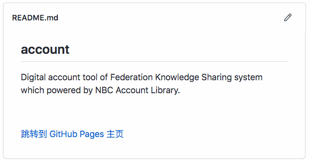
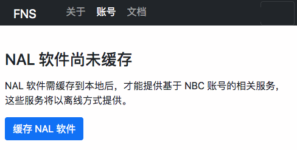
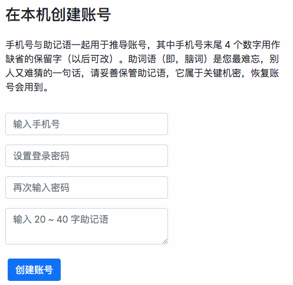
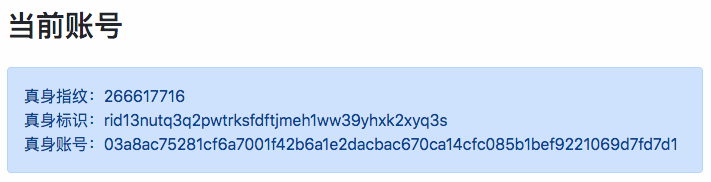

创建一个自主账号 { .text-center }
----------------

&nbsp;

### 如何创建账号

NBC 账号管理器当前只支持在桌面电脑的 chrome 或 Edge 浏览器中使用，请在浏览器访问本产品的开源站点 [fn-share/account](https://github.com/fn-share/account)。

在 github 开源项目的主页中，点击 “跳转到 GitHub Pages 主页” 链接，如下图：

本管理器是静态页网站，也在 github 上托管，点击上面链接，浏览器将从开源项目页跳转到静态网站主页。

然后在静态站网页点击 “账号” 导航栏，如下图：

点击 “缓存 NAL 软件” 按钮，系统将拉取服务组件到本地，之后在如下界面填入手机号、登录密码、助记语。为防止遗忘助记语，用户不妨找一张纸手抄一份，妥善保管这张纸，以便以后在浏览器（本机或其它机器）能顺利恢复当前账号**建立 入门 助记词 身份**{ .fns-keyword } 。

&nbsp;

### 真身标识

成功创建账号后，摘要页将显示当前账号的真身标识，如下图。

这个标识对外公开，别人用它标识当前账号，比方，别人想加你为好友，你需将 “真身标识” 告诉他。后文介绍的真身认证，也是由认证机构将 “真身标识” 与 “可用手机号” 绑捆并登记在案。**身份 朋友**{ .fns-keyword }
