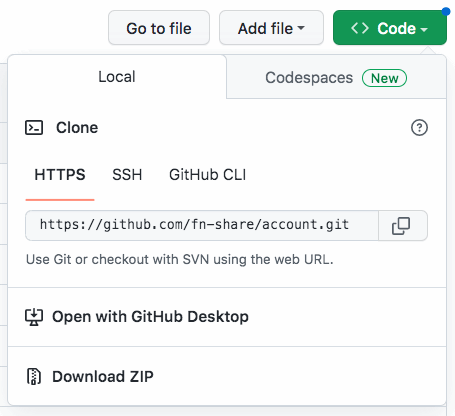
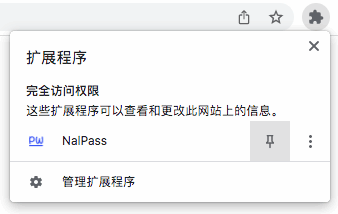

安装 NalPass 插件 { .text-center }
---------------

&nbsp;

### 为什么要安装 NalPass 插件？

当我们采用自主身份系统了，账号不再由中心化机构分配，而是改由 “账号管理器” 提供统一服务，任意多家应用网站，都由一个账号管理器后台提供服务。这时，控制账号所需的输入密码操作，也成公有操作，不归任一家网站独有，我们借助浏览器插件，在插件弹出的小窗中输入密码，然后当前网页才获得向账号管理器后台，请求签名或其它服务的授权。

如下图，网页请求授权时，用户点击 NalPass 插件（蓝色字体的 PW 按钮）后弹出一个密码输入框。

用 chrome 插件保障账号安全是 NBC DID 系统的一大特色，我们要求正式启用本体系的账号之前，都先安装 NalPass 插件 。

&nbsp;

### 下载插件

访问账号管理器的开源站点 `https://github.com/fn-share/account`，把项目源码下载到本地，如下图，点击 Code 按钮，再点击 Download ZIP。

&nbsp;

### 安装插件

把下载过来的 zip 解压缩，然后在 chrome 浏览器打开 `chrome://extensions/` 插件管理页，在该页中将 “开发者模式”（见下图右侧按钮）打开。

然后，点击 “加载已解压的扩展程序”，在弹出的文件选择框中，选中刚才从 zip 中解压出来的 `chrome-extension/nal-pass` 子目录 。

完成这一步安装后，在浏览器工具栏点击 “扩展程序” 按钮，在弹出配置页（见下图）点击 NalPass 插件右侧的小别针，让工具栏显示 NalPass 插件图标，以便今后要输密码授权时，在工具栏点击插件图标即弹出密码输入框。

说明，密码是保障用户账号安全的关键步骤，请大家认准在 [github 开源网站](https://github.com/fn-share/account) 与 [FNS 官网](https://www.fn-share.com) 提供的 NalPass 插件，不要随便安装其它任何人、任何组织提供 NalPass 插件。
