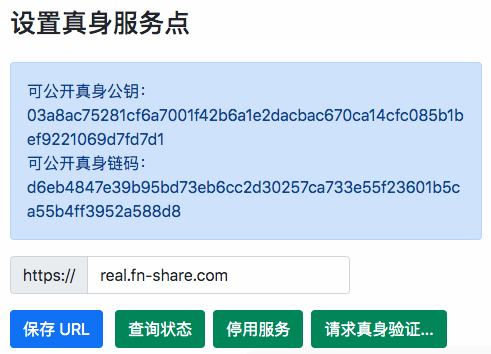
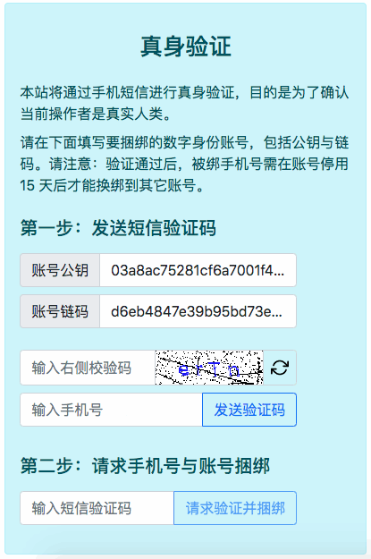

真身认证 { .text-center }
------------

&nbsp;

### 为什么要真身认证？

一个正常在用的 NBC DID 账号，应接受指定服务机构的真身认证（Real Person Verification），真身认证是为了确保使用者是真实人类，而非机器随意生成的任意多身份。本体系最低目标的真身认证是手机短信验证，拥有手机能完成短信验证的账号，被视作真实人类持有的账号。

FNS（Federation kNowledge Sharing）官方提供在线服务网站 `real.fn-share.com`，这是本体系缺省的一个真身认证网站，任何第 3 方在遵守一定规则的基础也可自行搭建 NBC DID 账号的真身认证网站。这些提供在线真身服务的站点称为 RSP（Real Server Point），在线真身服务包括：真身验证、发放护照、验证护照、账号挂失等。

真身认证是本账号体系的最重要安全措施，能有效防止与身份关联的资源被滥用的情况发生。比如，某应用网站向公众提供网盘服务，任何人可以享受 100G 的免费空间，如果本账号系统缺少真身认证过程，机器生成的海量女巫账号也将享受免费空间，服务商资源很容易被滥用。

虽然 NBC DID 账号不经真身认证也可以使用，但这样的账号被视为 “游客” 身份，游客身份在多数应用网站都有使用场景限制。对于 FNS 社区，多数应用网站不支持用户按游客身份登录，所以，接受真身认证可以说是进入 “联邦知识分享” 体系的一把钥匙 。

&nbsp;

### 请求真身认证

在 FNS 账号管理器主页的 “账号” 导航页中，选择左边栏 “真身验证” 后，右侧将展示 “设置真身服务点” 的配置项，如下图：

采用缺省的真身认证机构 `real.fn-share.com`，点击 “请求真身验证” 按钮后，将打开如下新网页。

填写正确的手机号后点击 “发送验证码” 按钮，等收到短信后，填写短信验证码，最后点击 “请求验证并捆绑” 按钮，即完成已验真身的手机号与当前账号捆绑。此后，当前认证机构 `real.fn-share.com` 就可以为已认证用户提供护照发放、验证，账号挂失等服务了 。

&nbsp;

### 如何挂失账号？

如果用户想停用当前账号，只需在 “设置真身服务点” 的相关配置中，点击 “停用服务” 按钮（参见上文图片），系统即自动向真身服务点（Real Server Point，RSP）发出挂失请求。

操作成功后，RSP 将标记当前账号状态为停用，不再发放护照，随后相关应用网站将不再支持重要操作，即，针对安全意义重大的操作，应用网站应随时向 RSP 查询账号状态，用户账号若已挂失就应拒绝服务**遗失 报失 客服 小心**{ .fns-keyword } 。

&nbsp;
