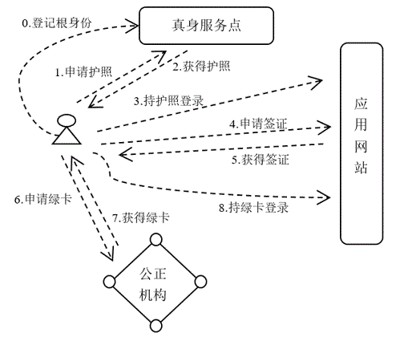

护照签证及绿卡 {: .text-center }
------------

&nbsp;

### 相关概念

为方便自主身份应用，NBC DID 系统设计了护照、签证、绿卡机制，这 3 者在概念上，与大家日常已熟悉的现实中的护照、签证、绿卡很接近。

其中，护照反映网络公民的原生身份，或者说出生地身份；签证是具备自主领地的应用网站，准许特定用户登录的许可证明；绿卡则是用户在某家网站被授予权利的正式凭证。护照表达各式身份 ID 背后的唯一真身，签证是领主发出的邀请函，邀请函具有 “一次邀请一次使用” 的特点，并不表达用户的长久居留权，将签证换成绿卡，绿卡才表达长久居留权，用户日常应持绿卡登录应用网站。

&nbsp;

### 卡证申领流程

如上图，用户在自主创建账号后，向真身服务点（Real Server Point）登记可公开真身的根身份，登记后，RSP 就有能力为用户开具护照了。

应用网站通常要为用户提供资源（如网络存贮、数据库索引、GPU 算力等），资源需要标识，建议取用户可公开真身标识作为识别依据。这里说的资源 resource 是一种抽像概念，与提供什么服务相关，资源可视为应用网站为用户所提供的某类服务要付出的各项成本总和，比方博客网站，服务方除了提供网络存贮，还有数据库查询、上下行带宽等，可以抽象成 “托管空间” 资源。后续颁发签证、颁发绿卡等均围绕服务方的资源如何授权展开。

应用网站须支持用户以两种方式登录，一是持 *元护照* 登录，二是持 *绿卡* 登录，由真身服务点颁发的护照有两类，一类是 **元护照**，出具真身标识来代表唯一真身，另一类是 **泛护照**，隐式指向某个真身，颁发护照的服务器知道它与哪个真身有关联，但外界并不清楚它指向哪个真身。用元护照登录表示用户以真身登录，关联指向很明确，因为真身标识已出具，网站服务商可以据此对用户画像；而用绿卡登录，服务商只知用户化身，无法关联真身，数据挖掘能力大幅降低，隐私保护也得以加强。一个设计良好的应用网站，应允许用户凭绿卡登录后可使用大部分功能，只有少量关键功能（比方支付、更改配置等）才需用元护照登录。

用户登录到应用网站，若想申请签证，就由网站出具一份证明，登录者需告诉网站若干信息，如：哪些权利将被授权，授权对象是谁，要授权多久，是否允许二次授权等。其中二次授权是指该签证换发绿卡后，用户持此绿卡登录是否允许他再次请求签证，以便二次换发绿卡。

授权对象必须是 *泛护照* 所记录的身份，也就是说，应用网站知道当前可用资源已授权给某个真身，但具体是哪个真身并不知晓，有可能是请求授权者自己，也可能是别人。

当用户获得应用网站颁发的签证后，他就可以到某指定的公正机构用签证换取绿卡了，公正机构为此设置的服务点，我们称为通密服务点（Crypto Server Point）。签证换取绿卡的目的在于，将被授权对象的账号换成属于同一人的另一个账号，以便切断或减缓应用网站可能借助登录者身份实施跟踪。之所以要强调要由公正机构提供签证换取绿卡服务，是因为换绿卡过程必须公正，否则，对于应用网站，他会担心一个付费账号会被无限多人使用，导致网站的利益受损，对于终端用户，他也担心绿卡会不会被通密服务点制作多份，未授权的人也获得许可，从而引发安全风险。

NBC DID 中支持签证换绿卡的机构公正性，主要靠技术手段去保障，包括：零知识证明、多维度二次验证、去中心化服务等。后面还会详述，总之，公正机构会依据同属证明（即，证明两个账号同属于某个真身）实现签证里指定的权利归属从被授权对象的账号迁移到另一个与之具有同属关系的账号下。**这里所提的公正机构，可以是某个值得信任的公司或政府部门，也可以是某个公共区块链系统**。

最后，在获得绿卡后，被授权用户就以绿卡所记录的化身身份，登录应用网站进行各项日常操作。因为绿卡中的化身与签证中的授权对象（即，泛身份）没有直接关联，从公开信息无法推导两者关联性，所以，持绿卡登录可以有效保护个人隐私、阻断数据挖掘。
