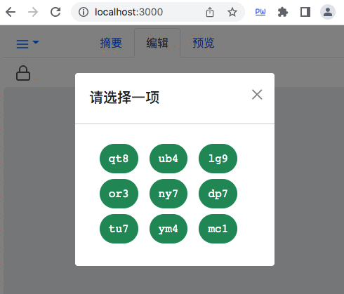

在 netlog 网站试用账号 {: .text-center }
--------------

&nbsp;

### netlog 网站的功能

netlog 提供网络日志功能，它最初为验证 NAL（NBC Account Library）而开发，该产品已在 github 上 [fn-share/fn-netlog](https://github.com/fn-share/fn-netlog) 开源。任何人可以拉取该 repo 到，并在本地运行 web 服务，或者，把它布署到云端也是可以的。

FNS 官方已在云端布署了 netlog 服务，供大家免费使用，请点击访问这个网站 [netlog.fn-share.com](https://netlog.fn-share.com) ，下面我们依据官网 netlog 的功能展开介绍。

netlog 主要功能：

1. 使用元护照或绿卡登录网站，允许以管理员、主编、读者三种角色中的一种登录。
2. 在线编辑 markdown 脚本，支持预览显示效果，定稿后由管理员提交发布。
3. 借助签证实现角色授权，既可以授权自己，也可以授权他人使用自己的资源。
4. 采用开锁、关锁机制确保任何时候限一人可编辑，同一份网志授权给多人使用后，互斥锁能防止多人同时编辑。

netlog 可以运用于实际工作，比如，一个团队每周要开例会，例会前各成员应总结自己的工作，只需在 netlog.fn-share.com 创建一个账号，把它授权给每个成员使用，大家约定在不同时段编辑 netlog，最后由管理员（一般由项目经理担任）定稿，在例会前提交发布。

&nbsp;

### 登录者的角色

NBC DID 体系利用签证实现授权，登录依据角色，授权也依据角色展开，被授予的权利一般是对应角色正常可拥有的权限，或者，比常规权利略少，因为授权时可以附带参数，参数常用来表达限制条件，能缩小权利范围。即，应用网站颁发签证时，要确保签证中记录的权限不能大过当前登录者已拥有的权利。

netlog 的 “读者” 是 “只读使用” 的角色，只阅读，不能编辑；“主编” 则允许编辑，但没有发布权限；“管理员” 拥有全部权限，包括发布 netlog 。

&nbsp;

### 持元护照登录

用户首次登录 netlog 网站时，系统就弹出如下对话框，要求选择一个角色进行登录，并不需要在 netlog 事先注册一个账号。

应用网站免注册是去中心化程序（Decentralized Application，DAPP）一大特色，个人账号已自主创建，应用网站不必重复为用户分配账号，当然，一定要分配也可以，但不是鼓励的使用方式。

然后点 “登录” 按钮，网页将提示等待授权，这时用户要点击 NalPass 插件，输密码授权。

完成登录后，在主页左上角的下拉菜单中选择 “登录者身份” ，系统将显示当前登录者的角色、使用身份、账号公钥等信息。

&nbsp;

### 授权与转授权

在下拉菜单中选择 “授权生成签证”，系统将弹出授权配置对话框，如下图。

指定是否允许二次授权、签证有效期，然后在授权对象的真身标识一栏填入以 `rid1` 开头的真身标识，授权对象既可以是自己的真身标识，也可以是别人的标识（表示授权给他人使用）。

再点 “生成签证” 按钮，随后输入密码确认授权，稍候，系统将弹出如下图提示，表示授权成功，对应的签证已生成（签证文件暂存在 netlog 网站）。如果是授权给自己，要点击 “点此打开” 的链接，以便将签证文件拉取到本机数据库。如果是授权给别人，还需将下载签证的链接发送给别人，由别人完成签证文件的拉取工作。

&nbsp;

### 验证保留字

除了前面已介绍的输入密码来验证操作者身份，本软件还支持在安全要求不高的场合，通过选择保留字来验证身份。

用户刚创建账号时，缺省的保留字是创建账号所用手机号的末尾 4 个数字（这个保留字可在 FNS 账号管理器网页中修改）。比方，在 netlog 的编辑页，点击开锁按钮时，系统将弹出如下对话框，要求当前操作者选择正确的保留字。

如果选错，系统将立即锁住 NAL 账号服务，接下来用户如果继续操作，系统将自动启用密码验证，输对密码后，账号服务才能恢复。

&nbsp;

### 其它功能

netlog 功能较为单一，本文只简述，不展开讲解。

netlog 的编辑或预览，只需切换到对应的导航页后执行相关操作。

发布 netlog 需以管理员身份登录，包括持护照登录，或者持已授权获得的绿卡登录，登录后运行 “发布 Netlog” 菜单即可。

值得一提的是，netlog 登录后，网站服务器将分配一个 token 作为操作凭证，这个 token 每隔一段时间会由网页自动请求更新。用户一次登录大约可用 20 小时，超过这个时间需要重新登录。

另外，编辑 markdown 脚本前要开锁，完成编辑应随手关锁，大家宜养成此习惯，如果忘关锁，可能导致别人无法编辑，要等足 20 小时，让他登录失效后才能接手编辑。或者，还可以借助管理员的特别权力，以管理员身份登录后强行开锁，也能立即继续编辑。
